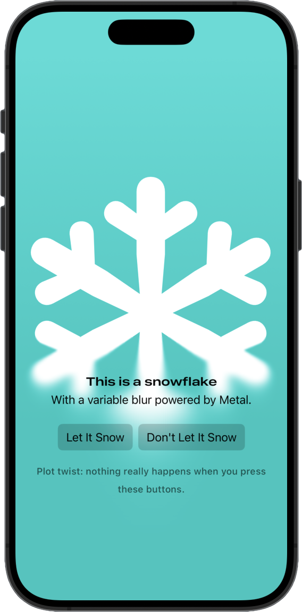

# Variablur

> [!NOTE]
> This code is now included in the project that inspired it, [twostraws/Inferno](https://github.com/twostraws/Inferno). Consider using that package instead, as any future improvements or additional shaders are likely to end up there.

With Variablur, you can create variable blur effects that you control with a mask. Because you draw the mask using a `GraphicsContext`, it can contain gradients, shapes, text, pre-rendered images, or anything else you can draw into a `GraphicsContext`.

You can create gradient or progressive blurs, vignettes, "blur shadows", or many other effects.

### More info

- The blur radius is controlled per pixel for a true variable gaussian blur effect
- Variablur uses 100% public API – it's just a Metal shader and a couple extensions to SwiftUI types
- In my testing it runs smoothly even when applied to large, animated views or combined with other shaders. If performance is an issue, there's an option to lower the sample count. That said, I'm sure it could be optimized further and would be grateful for a PR that improves performance.
- SwiftUI's visual effects can only be applied to pure SwiftUI views, and this library shares that limitation.

## Examples

To see live examples of various effects you can achieve with different masks, clone this repository, open it in Xcode, and look in `Sources/Variablur/View+variableBlur.swift` for Xcode previews.

## Usage with Swift Package Manager

Add Variablur to your project: `https://github.com/daprice/Variablur`
